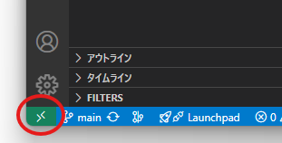
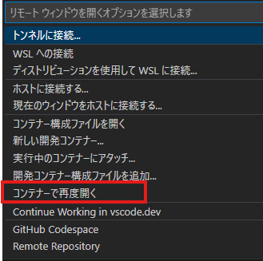
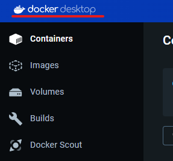
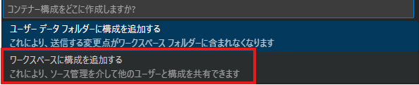
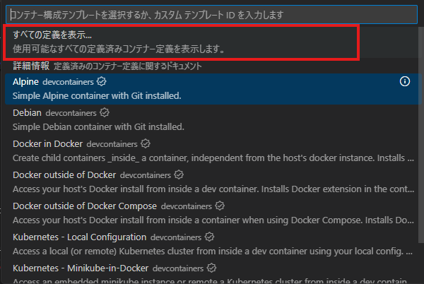
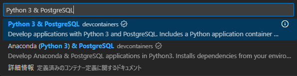

# インストール

## Remote Development インストール(Dev Containersを含んでいる)

- Remote Development は、Dev Containers　を含んでいる
  - WSL
  - Dev Containers
  - Remote - SSH
  - Remote - Tunnels
- どっちでもよい。

## devcontainer 設定

- すみっこのこれ
    

- xxxxxxxxxx
    

- windowsだったら このタイミングでdockerが起動する
    

  - 再度隅っこ押すと選択肢が変わってくるので「」を選択
      

- 一旦これを選択
    

- 「Python 3 & PostgreSQL」を選択
    

## memo

- [VSCode Dev Containerを使った開発環境構築 | KINTO Tech Blog | キントテックブログ](https://blog.kinto-technologies.com/posts/2022-12-10-VSCodeDevContainer/)
- [Specification Dev Container metadata reference](https://containers.dev/implementors/json_reference/#remoteUser)
- [Dockerのインストール](https://zenn.dev/hr0t15/articles/91f472b324e42c)
